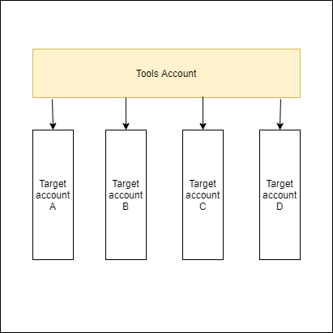

# IAM Users/Roles/Policies for Multi-account deployment

This is a CDK application to create IAM User, Roles, and Policies to allow Github action to deploy CDK application to AWS account with least permissive permissions.

## Structure 

In this scenario, there're 2 types of account
- **Tool account** - this is where our deploy system logs into to assume role into
- **Target account** - account where applications are deployed to

